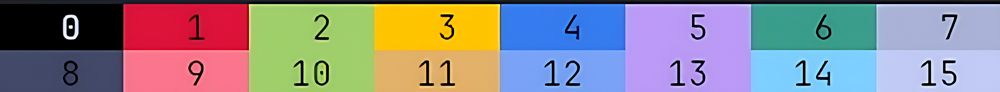
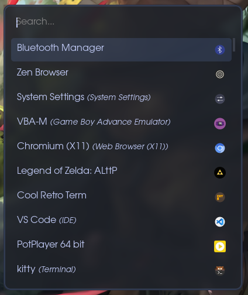
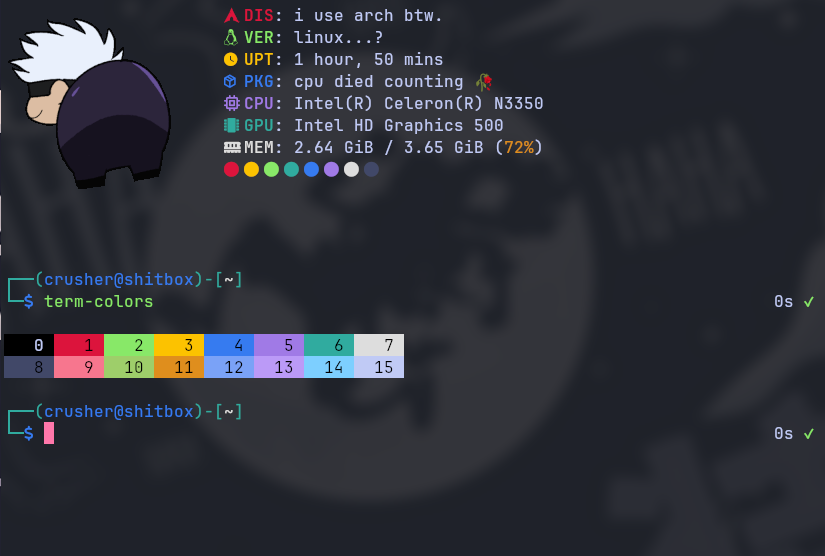
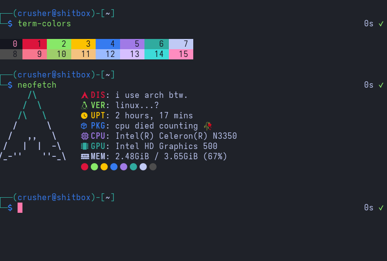

<h1 align="center">

</h1>
<p align="center">A sleek Tokyo Night + Kali Dark inspired theme, customized for maximum chill vibes.</p>

<h1 align="center">

</h1>

---

<h1 align="center">Navigation</h1>

<p align="center">
  <a href="#rofi">Rofi</a> |
  <a href="#kitty">Kitty</a> |
  <a href="#alacritty">Alacritty</a>
</p>
<br>

---

# Rofi

A dark, stylish theme for Rofi, perfect for late-night browsing and launcher sessions.  

Copy the theme in this repo to your Rofi config folder or reference it directly in your Rofi config:  
```bash
.config/rofi/config.rasi
````



---

# Kitty

A moody, readable terminal theme for Kitty.

**Configuration file:**

1. Place `tokali.conf` in the same directory as your Kitty config (usually `~/.config/kitty/`).
2. Include it in your main `kitty.conf` by adding:

```conf
include ~/.config/kitty/tokali.conf
```



---

# Alacritty

A moody, readable terminal theme for Alacritty, inspired by Tokali’s Tokyo Night + Kali Dark vibe.

**Configuration file:**

1. Place `tokali.toml` in your Alacritty themes directory (usually `~/.config/alacritty/themes/`).
2. Include it in your main `alacritty.toml` by adding:

```toml
[general]
import = [
  "~/.config/alacritty/themes/tokali.toml"
]
```



---

<h1 align="center">Contributing</h1>

Tokali is yours to tweak too. Feel free to open issues, submit PRs, or suggest improvements—more than happy to see what you add!  

All theme colors are listed in [colors.txt](./colors.txt) for easy reference, so anyone can port Tokali to other apps or create their own versions.
